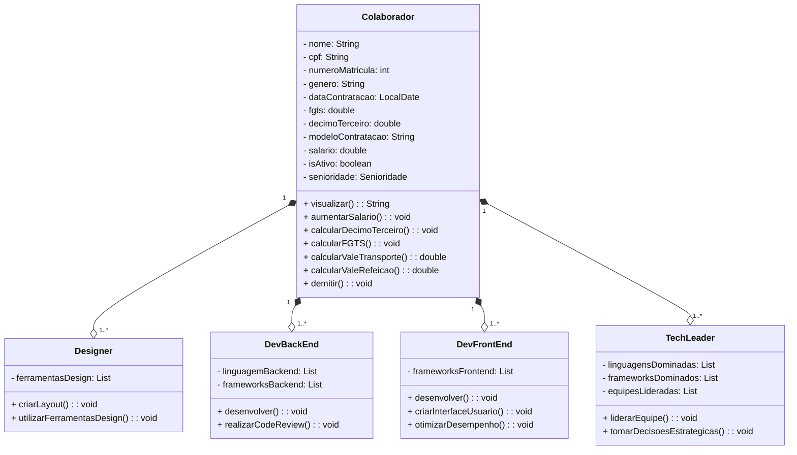

## Diagrama de Classes e Relacionamentos

```mermaid
classDiagram

class Colaborador {
  - nome: String
  - cpf: String
  - numeroMatricula: int
  - genero: String
  - dataContratacao: LocalDate
  - fgts: double
  - decimoTerceiro: double
  - modeloContratacao: String
  - salario: double
  - isAtivo: boolean
  - senioridade: Senioridade
  + visualizar(): String
  + aumentarSalario(): void
  + calcularDecimoTerceiro(): void
  + calcularFGTS(): void
  + calcularValeTransporte(): double
  + calcularValeRefeicao(): double
  + demitir(): void
}

class Designer {
  - ferramentasDesign: List<String>
  + criarLayout(): void
  + utilizarFerramentasDesign(): void
}

class DevBackEnd {
  - linguagemBackend: List<String>
  - frameworksBackend: List<String>
  + desenvolver(): void
  + realizarCodeReview(): void
}

class DevFrontEnd {
  - frameworksFrontend: List<String>
  + desenvolver(): void
  + criarInterfaceUsuario(): void
  + otimizarDesempenho(): void
}

class TechLeader {
  - linguagensDominadas: List<String>
  - frameworksDominados: List<String>
  - equipesLideradas: List<String>
  + liderarEquipe(): void
  + tomarDecisoesEstrategicas(): void
}


Colaborador "1" *--o "1..*" Designer
Colaborador "1" *--o "1..*" DevBackEnd
Colaborador "1" *--o "1..*" DevFrontEnd
Colaborador "1" *--o "1..*" TechLeader

```
